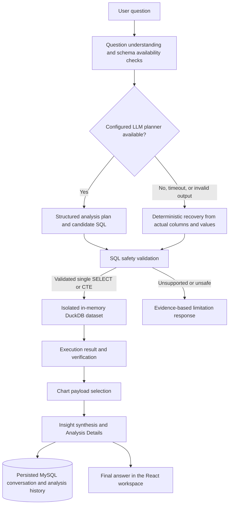

# AI Business Analyst — Autonomous Data Analyst

AI Business Analyst is a full-stack analytics workspace that turns uploaded CSV/XLSX files into evidence-grounded business answers. It addresses a practical problem: teams often need answers from operational data before a dedicated analyst can model every question. Users sign in, upload a dataset, ask a business question in natural language, and receive a SQL-backed result, chart payload, explanation, and transparent execution record.

The project is designed as a portfolio-quality AI Engineering system: LLM output is bounded by schema-aware planning and SQL safety controls, while deterministic analytical recovery keeps supported questions useful when a model is unavailable.

## Key capabilities

| Capability                          | Implementation                                                                                                                                                        |
| ----------------------------------- | --------------------------------------------------------------------------------------------------------------------------------------------------------------------- |
| Natural-language business analytics | Questions are interpreted against a selected, user-owned CSV/XLSX dataset.                                                                                            |
| Autonomous planning with recovery   | A configurable OpenAI-compatible model can create structured plans; invalid, unavailable, or timed-out planning falls back to deterministic analysis where supported. |
| SQL-backed evidence                 | The analytical layer creates an isolated in-memory DuckDB table and executes only validated `SELECT`/CTE queries.                                                     |
| Dataset understanding               | Upload processing normalizes encoding, infers types, profiles missing values and distributions, and exposes dataset metadata.                                         |
| Visualization and insights          | The backend emits chart-ready payloads for KPI, line, bar, area, pie/donut, scatter, and histogram views alongside grounded business insights.                        |
| Conversational workspace            | Per-user conversations, messages, analysis runs, history, and saved insights persist in MySQL.                                                                        |
| Transparent execution               | The UI can display validated SQL, referenced columns, execution stages, tool use, timings, rows, and model-recovery evidence.                                         |
| Security controls                   | Signed sessions, user-scoped access, validated input, private file storage, safe SQL restrictions, and user-safe errors are implemented end to end.                   |

## AI and analytics architecture



The LLM receives only compact schema and result context. It never receives database credentials or direct database access. The SQL guard allows one query against the temporary `dataset` table and rejects mutations, DDL, comments, multiple statements, filesystem scans, remote reads, and system functions before execution. See [`docs/AI_WORKFLOW.md`](./docs/AI_WORKFLOW.md) and [`docs/ARCHITECTURE.md`](./docs/ARCHITECTURE.md) for implementation detail.

## Tech stack

| Area           | Technologies actually used                                                                                   |
| -------------- | ------------------------------------------------------------------------------------------------------------ |
| Frontend       | React 19, TypeScript, Tailwind CSS 4, Recharts, Wouter, TanStack Query, tRPC client                          |
| Backend        | Node.js 22, Express 5, tRPC 11, Zod, SuperJSON                                                               |
| AI/LLM         | OpenAI-compatible Chat Completions endpoint, structured planning, bounded timeout and deterministic recovery |
| Database       | MySQL 8.4, Drizzle ORM, committed Drizzle migrations                                                         |
| Data analysis  | DuckDB embedded per request, csv-parse, ExcelJS, chardet, iconv-lite                                         |
| Authentication | Local credential sign-in with signed JWT session cookies via `jose`                                          |
| Testing        | Vitest and TypeScript compiler checks                                                                        |
| DevOps         | Docker, Docker Compose, GitHub Actions, pnpm                                                                 |

## Project structure

```text
client/                 React dashboard, pages, components, and typed tRPC client
server/                 Express/tRPC API, sessions, storage, database helpers, analytics
server/analytics/       Profiling, SQL safety, deterministic analysis, orchestration, charts
drizzle/                MySQL schema, relations, and committed migrations
docs/                   Architecture, API, AI workflow, database, local-development notes
sample-data/            Deterministic sales CSV and example analyst questions
scripts/                Sample-data generation and configuration validation
.github/workflows/      CI type-check, test, and build workflow
docker-compose.yml      Local MySQL and application stack
local.env.template      Credential-free environment template
```

## Prerequisites

Install **Node.js 22 LTS**, Docker Desktop with Docker Compose (recommended for MySQL 8.4), and Git. This repository pins **pnpm 10.4.1**. No Python runtime is required.

## Local development on Windows 10/11 and VS Code

Open the cloned repository in VS Code, then use the integrated PowerShell terminal:

```powershell
npm install --global corepack@latest
corepack enable
corepack install
pnpm install --frozen-lockfile
Copy-Item local.env.template .env
```

Edit `.env` before running the app. Replace every `replace-with-...` value with a strong, local-only value; never commit `.env`.

```powershell
# Start MySQL only, apply the committed schema, generate sample assets, and run the dev server.
docker compose up -d db
pnpm db:migrate
pnpm sample:export
pnpm dev
```

Open [http://localhost:3000](http://localhost:3000), sign in with `LOCAL_AUTH_EMAIL` and `LOCAL_AUTH_PASSWORD`, choose **Use sample sales data**, and ask a question such as **What is our total revenue?**

### Environment variables

| Variable                                                                | Required                   | Purpose                                                                                             |
| ----------------------------------------------------------------------- | -------------------------- | --------------------------------------------------------------------------------------------------- |
| `JWT_SECRET`                                                            | Yes                        | Long random key used to sign httpOnly local session cookies.                                        |
| `LOCAL_AUTH_EMAIL`, `LOCAL_AUTH_PASSWORD`                               | Yes                        | Private local-development sign-in credentials.                                                      |
| `LOCAL_AUTH_NAME`, `LOCAL_AUTH_ROLE`                                    | Yes                        | Display name and `admin` or `user` role for the local workspace user.                               |
| `MYSQL_DATABASE`, `MYSQL_USER`, `MYSQL_PASSWORD`, `MYSQL_ROOT_PASSWORD` | Yes for Docker Compose     | Local MySQL container configuration.                                                                |
| `DATABASE_URL`                                                          | Yes for native development | MySQL URL used by Drizzle; Docker Compose injects its own internal URL into the app container.      |
| `STORAGE_DIR`                                                           | Optional                   | Local private upload directory; defaults to `./data/uploads`.                                       |
| `LLM_BASE_URL`, `LLM_API_KEY`, `LLM_MODEL`                              | Optional                   | OpenAI-compatible endpoint, provider key, and model identifier for planning and insight enrichment. |
| `APP_URL`, `PORT`                                                       | Optional                   | Browser origin and local server port; default to `http://localhost:3000` and `3000`.                |

### Database and sample data

`pnpm db:migrate` provisions a fresh MySQL database from the committed migrations in `drizzle/`. For schema changes, run `pnpm db:generate`, review the generated SQL, and then run `pnpm db:migrate`.

The repository includes a deterministic 224-row sales-order dataset and 16 example questions in [`sample-data/`](./sample-data/). Regenerate them with `pnpm sample:export`. The in-app sample action writes a user-owned copy through the ordinary storage and database path.

## Docker Compose

To run the production-built app and MySQL together:

```powershell
Copy-Item local.env.template .env
# Edit the local secrets and passwords in .env first.
docker compose up --build
```

The application waits for MySQL, applies committed migrations, and serves the app on port `3000`. The named `mysql_data` and `uploads_data` volumes preserve local development data. Use `docker compose down` to stop services while retaining volumes.

## AI configuration and deterministic fallback

The application accepts any OpenAI-compatible Chat Completions provider through `LLM_BASE_URL`, `LLM_API_KEY`, and `LLM_MODEL`. The recommended default is `gpt-4o-mini`, configured in the template. Keep `LLM_API_KEY` server-only and never place it in client code.

An LLM key is optional. With a blank key—or when planning fails, times out, or produces unsupported SQL—the application records the recovery path and attempts deterministic, SQL-backed analysis using only actual dataset columns and values. Unsupported requests return an explicit limitation rather than an invented interpretation.

## Commands

| Task                         | Command              |
| ---------------------------- | -------------------- |
| Start development server     | `pnpm dev`           |
| Build production assets      | `pnpm build`         |
| Run the production build     | `pnpm start`         |
| Type-check                   | `pnpm check`         |
| Run tests                    | `pnpm test`          |
| Apply migrations             | `pnpm db:migrate`    |
| Generate a migration         | `pnpm db:generate`   |
| Validate local configuration | `pnpm config:check`  |
| Regenerate sample assets     | `pnpm sample:export` |

## Testing and CI

The verified automated suite currently contains **22/22 passing tests** across parsing, malformed uploads, SQL safety, real DuckDB results, deterministic analysis, multi-turn context, timeout recovery, authentication, and user-scoped deletion. Run it locally with:

```powershell
pnpm check
pnpm test
pnpm build
```

GitHub Actions runs the same locked dependency installation, type-check, test suite, and production build on every push and pull request. It requires no application secrets.

## Security model

The application uses signed, httpOnly local session cookies and scopes dataset, conversation, analysis, and saved-insight operations to the authenticated user. Input schemas validate API payloads, uploads are validated before profiling, file bytes remain on private local storage rather than in MySQL, and user-safe failures avoid returning raw infrastructure errors.

Analytical SQL is defense-in-depth constrained to a single validated `SELECT`/CTE query against an isolated in-memory table. The guard rejects data mutation, schema changes, multi-statement execution, comments, file/remote scans, and system functions. Secrets belong only in ignored local environment files; the repository contains a placeholder-only template.

## Documentation

| Document                                                   | Contents                                                              |
| ---------------------------------------------------------- | --------------------------------------------------------------------- |
| [`docs/ARCHITECTURE.md`](./docs/ARCHITECTURE.md)           | Request flow, persistence, storage, and analytical boundaries         |
| [`docs/AI_WORKFLOW.md`](./docs/AI_WORKFLOW.md)             | Planning, SQL validation, recovery, and transparent execution details |
| [`docs/API.md`](./docs/API.md)                             | tRPC API contracts and usage                                          |
| [`docs/DATABASE.md`](./docs/DATABASE.md)                   | MySQL entities, migrations, and data ownership                        |
| [`docs/LOCAL_DEVELOPMENT.md`](./docs/LOCAL_DEVELOPMENT.md) | Native and containerized local workflows                              |
| [`docs/PORTABILITY.md`](./docs/PORTABILITY.md)             | Local replacements for hosted runtime dependencies                    |

## License

This project is released under the [MIT License](./LICENSE).

## Production note

The included local credential session is appropriate for private development. For a shared production workspace, integrate an external identity provider at the documented session boundary and protect the deployment, database, storage, and LLM provider credentials accordingly.
