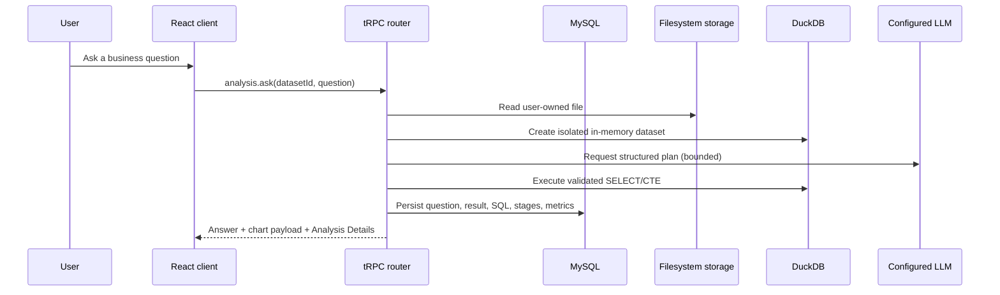

# Architecture

The codebase intentionally keeps the existing full-stack layout: `client/` contains the React dashboard, `server/` contains Express, tRPC, storage, sessions, analytics, and database helpers, `drizzle/` contains the MySQL schema and migrations, and `sample-data/` contains reproducible onboarding assets.

The browser communicates only with `/api/trpc` using credentialed requests. The server authenticates the signed local session, scopes every database helper by user ID, reads the selected user-owned dataset from `STORAGE_DIR`, profiles it, and creates a temporary in-memory DuckDB table for analytical work. File bytes are never stored in MySQL.

